

  

   

  
  
  
  

    

  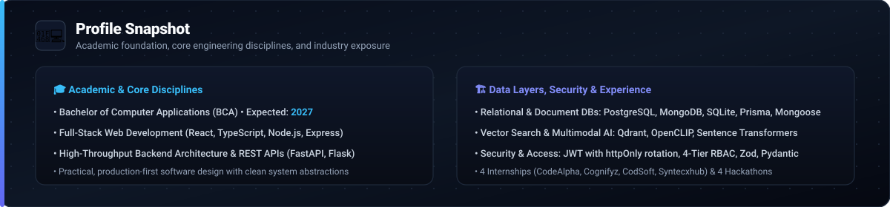

   

  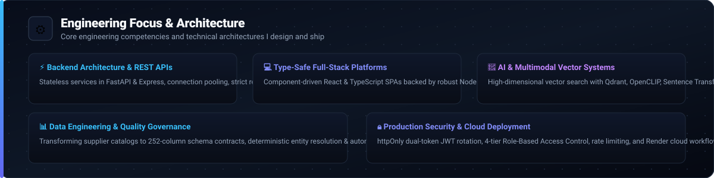

   

  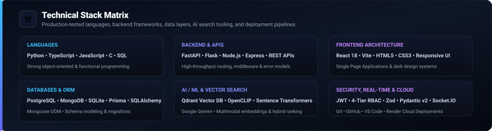

   

  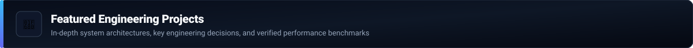

   

  <!-- Project 1: Nexora -->
  <a href="https://github.com/pk7745/CodeAlpha_Nexora">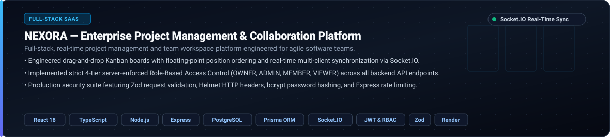</a>
  
<a href="https://github.com/pk7745/CodeAlpha_Nexora"><b>View Repository &rarr;</b></a>

  <!-- Project 2: LUMÉ -->
  
  
<a href="https://github.com/pk7745/CodeAlpha_lume-skincare-ecommerce"><b>View Repository &rarr;</b></a>

  <!-- Project 3: UNILOG -->
  <a href="https://github.com/pk7745/unilog-product-intelligence-engine">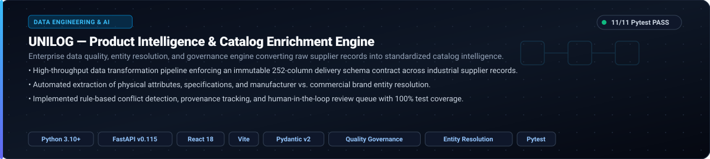</a>
  
<a href="https://github.com/pk7745/unilog-product-intelligence-engine"><b>View Repository &rarr;</b></a> &bull; <a href="https://unilog-product-intelligence-engine.onrender.com"><b>Live Demo &rarr;</b></a>

  <!-- Project 4: TailorTalk -->
  <a href="https://github.com/pk7745/tailortalk-saree-search">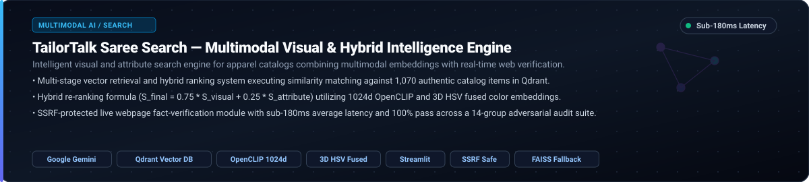</a>
  
<a href="https://github.com/pk7745/tailortalk-saree-search"><b>View Repository &rarr;</b></a>

  <!-- Project 5: Redrob Ranker -->
  
  
<a href="https://github.com/pk7745/redrob-ranker"><b>View Repository &rarr;</b></a>

  <!-- Project 6: URL Shortener API -->
  
  
<a href="https://github.com/pk7745/url-shortener-api"><b>View Repository &rarr;</b></a>

  <!-- Project 7: Sahaya AI -->
  <a href="https://github.com/pk7745/sahaya-ai">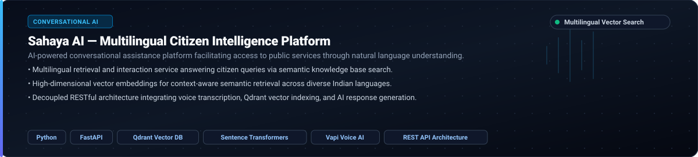</a>
  
<a href="https://github.com/pk7745/sahaya-ai"><b>View Repository &rarr;</b></a>

  <!-- Project 8: BMS College ERP -->
  <a href="https://github.com/pk7745/erp">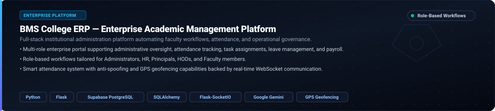</a>
  
<a href="https://github.com/pk7745/erp"><b>View Repository &rarr;</b></a>

   

  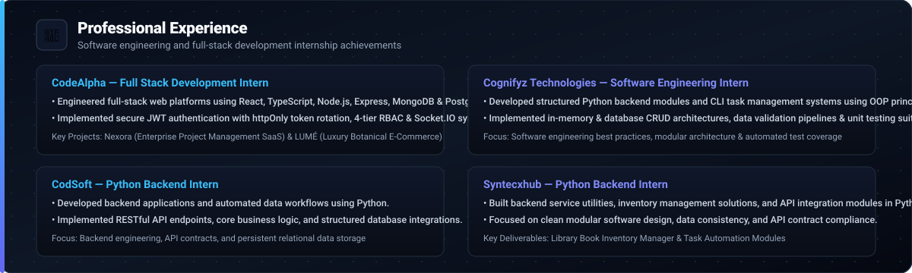

   

  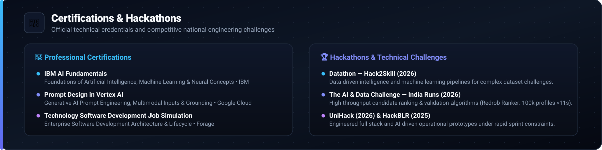

   

  
  
   
  

    

  <a href="mailto:pk9396247@gmail.com">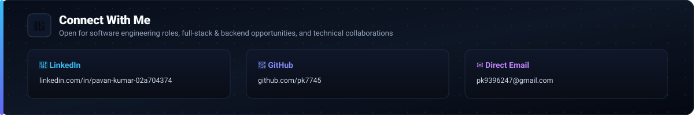</a>

