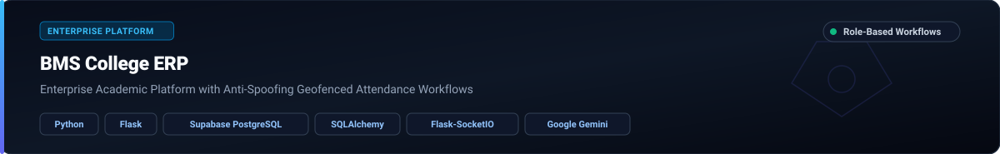

  

   

  
  
  
  

- 🎓 **Academic Standing:** Bachelor of Computer Applications (BCA) • Expected Graduation: **2027**
- ⚙️ **Core Engineering Focus:** Full-Stack Web Applications, Backend Architecture, REST API Engineering, and AI/ML Systems
- 🏗️ **Data & Storage Systems:** Relational & document databases (PostgreSQL, MongoDB, SQLite), ORM/ODM modeling (Prisma, SQLAlchemy, Mongoose), and vector databases (Qdrant)
- 🔐 **Security & Access Control:** JWT authentication with httpOnly refresh token rotation, Role-Based Access Control (RBAC), schema validation (Zod, Pydantic v2), and cloud deployment workflows
- 💼 **Industry Experience:** Full-stack and Python backend internships across CodeAlpha, Cognifyz Technologies, CodSoft, and Syntecxhub
- 🏆 **Competitive Engineering:** Active participant in nationwide hackathons (Hack2Skill Datathon, India Runs AI & Data Challenge, UniHack, HackBLR)

 

- **Backend Architecture & APIs:** Designing robust, stateless RESTful services with FastAPI, Express, and Flask; enforcing strict request validation, structured error handling, and standard HTTP response contracts.
- **Full-Stack Application Development:** Building responsive, type-safe interfaces in React and TypeScript backed by scalable Node.js and Python backend microservices.
- **AI & Intelligent Systems:** Developing multimodal semantic search pipelines, vector retrieval with Qdrant, hybrid re-ranking models, and domain-grounded LLM orchestration.
- **Data Engineering & Governance:** Transforming raw multi-format datasets into validated schema contracts, implementing deterministic entity resolution, quality scoring, and automated audits.
- **Production & Security Workflows:** Implementing token-based authentication (JWT), password hashing (bcrypt), granular Role-Based Access Control (RBAC), and cloud deployments on Render.

 

| Domain | Technologies & Frameworks |
| :--- | :--- |
| **Languages** |      |
| **Backend & APIs** |      |
| **Frontend** |     |
| **Databases & ORM** |       |
| **AI / ML & Vector Search** |     |
| **Security & Real-Time** |       |
| **Tools & Cloud** |     |

 

### 1. NEXORA — Enterprise Project Management & Collaboration Platform

- **What I Built:** Comprehensive collaborative project suite featuring drag-and-drop Kanban boards with floating-point position ordering, slide-over task drawers, activity logging, and real-time multi-client synchronization.
- **Key Engineering:** React 18, TypeScript, Vite, Node.js, Express, PostgreSQL, Prisma ORM, Socket.IO, JWT, bcrypt, Zod.
- **Highlights:**
  - Strict 4-tier Role-Based Access Control (`OWNER`, `ADMIN`, `MEMBER`, `VIEWER`) enforced across all backend API endpoints.
  - Real-time bidirectional workspace synchronization powered by Socket.IO events.
  - Security suite featuring Zod request validation, Helmet HTTP headers, bcrypt password hashing, and rate limiting.
- **Links:** [Repository](https://github.com/pk7745/CodeAlpha_Nexora)

---

### 2. LUMÉ — Premium Botanical Skincare E-Commerce Platform

- **What I Built:** Complete e-commerce web application featuring dynamic catalog filtering, cart/wishlist management, checkout flows, and a dedicated admin dashboard with MongoDB-backed KPI analytics.
- **Key Engineering:** React, TypeScript, Vite, Node.js, Express, MongoDB, Mongoose, JWT, bcryptjs, Vitest, Supertest.
- **Highlights:**
  - Dual-token authentication system utilizing short-lived access JWTs and secure httpOnly refresh-token rotation.
  - Persistent analytics pipeline tracking real-time sales metrics, inventory health, KPI trends, and customer insights.
  - Comprehensive unit and integration testing coverage with Vitest and Supertest across API endpoints.
- **Links:** [Repository](https://github.com/pk7745/CodeAlpha_lume-skincare-ecommerce)

---

### 3. UNILOG — Product Intelligence & Catalog Enrichment Engine

- **What I Built:** High-throughput data transformation pipeline enforcing an immutable **252-column delivery schema contract** with automated brand resolution, category taxonomy mapping, and quality governance.
- **Key Engineering:** Python 3.10+, FastAPI v0.115, React 18, Vite, Pydantic v2, Pytest.
- **Highlights:**
  - Automated extraction of physical attributes, specifications, and manufacturer vs. commercial brand entity resolution.
  - Rule-based conflict detection, provenance tracking, and human-in-the-loop audit review queue.
  - Comprehensive testing suite with 100% pass rate across 11 verification batteries.
- **Links:** [Repository](https://github.com/pk7745/unilog-product-intelligence-engine) • [Live Demo](https://unilog-product-intelligence-engine.onrender.com)

---

### 4. TailorTalk Saree Search — Multimodal Visual & Hybrid Intelligence Engine

- **What I Built:** Multi-stage vector retrieval and hybrid ranking system executing similarity matching against 1,070 authentic catalog items.
- **Key Engineering:** Python, Google Gemini, Qdrant Vector Database, OpenCLIP (1024d + 3D HSV Fused Embeddings), Streamlit.
- **Highlights:**
  - Hybrid re-ranking formula ($S_{\\text{final}} = 0.75 \\cdot S_{\\text{visual}} + 0.25 \\cdot S_{\\text{attribute}}$) with strict hard constraint filtering.
  - SSRF-protected live webpage fact-verification module preventing hallucinated product availability.
  - Sub-180ms average retrieval latency with 100% pass across a 14-group end-to-end adversarial audit suite.
- **Links:** [Repository](https://github.com/pk7745/tailortalk-saree-search)

---

### 5. Redrob Ranker — AI-Powered Candidate Evaluation System

- **What I Built:** Data-driven ranking platform evaluating candidate profiles against job requirements using multi-factor weighted scoring.
- **Key Engineering:** Python, Pandas, NumPy, In-Browser Processing.
- **Highlights:**
  - 7-component weighted evaluation model with skill-trust validation and honeypot detection to penalize keyword-stuffing.
  - High-performance execution: processed and ranked **100,000 candidate profiles in under 11 seconds on CPU**.
  - Fact-grounded candidate comparison matrix with score breakdowns and ranking explanations.
- **Links:** [Repository](https://github.com/pk7745/redrob-ranker)

---

### 6. URL Shortener API — High-Performance REST Service

- **What I Built:** Production-ready API service converting long HTTP/HTTPS URLs into compact Base62 short codes with automatic HTTP 307 redirects.
- **Key Engineering:** Python, FastAPI, PostgreSQL, SQLAlchemy 2.0+, Pydantic v2, Render.
- **Highlights:**
  - Collision-resistant short code generator with database-level unique constraints and retry mechanisms.
  - Complete PostgreSQL persistence without in-memory state dependencies.
  - Comprehensive OpenAPI/Swagger documentation with strict Pydantic payload validation.
- **Links:** [Repository](https://github.com/pk7745/url-shortener-api)

---

### 7. Sahaya AI — Multilingual Citizen Intelligence Platform

- **What I Built:** Multilingual retrieval and interaction service answering citizen queries via semantic knowledge base search.
- **Key Engineering:** Python, FastAPI, Qdrant Vector Database, Sentence Transformers, Vapi Voice AI.
- **Highlights:**
  - High-dimensional vector embeddings for context-aware semantic retrieval across diverse languages.
  - Decoupled RESTful architecture integrating voice transcription, vector indexing, and AI response generation.
- **Links:** [Repository](https://github.com/pk7745/sahaya-ai)

---

### 8. BMS College ERP — Enterprise Academic Management Platform

- **What I Built:** Multi-role enterprise portal supporting administrative oversight, attendance tracking, task assignments, leave management, payroll, and real-time collaboration.
- **Key Engineering:** Python, Flask, Supabase PostgreSQL, SQLAlchemy, Flask-SocketIO, Google Gemini.
- **Highlights:**
  - Role-based workflows tailored for Administrators, HR, Principals, HODs, and Faculty members.
  - Smart attendance system with anti-spoofing and GPS geofencing capabilities.
  - Real-time communication layer powered by WebSockets.
- **Links:** [Repository](https://github.com/pk7745/erp)

 

- **CodeAlpha** — *Full Stack Development Intern*
  - Engineered production-oriented full-stack web platforms using React, TypeScript, Node.js, Express, MongoDB, and PostgreSQL.
  - Implemented secure JWT authentication with httpOnly token rotation, granular Role-Based Access Control (RBAC), and real-time Socket.IO synchronization on flagship platforms (*Nexora*, *LUMÉ*).
- **Cognifyz Technologies** — *Software Engineering Intern*
  - Developed structured Python backend modules and CLI task management systems using Object-Oriented Principles.
  - Implemented in-memory and database CRUD architectures, data validation pipelines, search/filtering algorithms, and unit testing suites.
- **CodSoft** — *Python Backend Intern*
  - Developed backend applications and automated workflows using Python.
  - Implemented RESTful API endpoints, core business logic, and structured database integrations.
- **Syntecxhub** — *Python Backend Intern*
  - Built backend service utilities, library inventory management solutions, and API integration modules in Python.
  - Focused on clean modular software design, data consistency, and API contract compliance.

 

#### 📜 Professional Certifications
- 🔹 **IBM AI Fundamentals** — IBM
- 🔹 **Prompt Design in Vertex AI** — Google Cloud
- 🔹 **Technology Software Development Job Simulation** — Forage

#### 🏆 Hackathons & Technical Challenges
- **Datathon** — *Hack2Skill (2026)*: Built data-driven intelligence and machine learning pipelines for complex dataset challenges.
- **The AI & Data Challenge** — *India Runs (2026)*: Developed high-throughput candidate ranking and validation algorithms (Redrob Ranker).
- **UniHack** — *Hack2Skill (2026)*: Engineered practical full-stack and AI-powered solutions under rapid sprint constraints.
- **HackBLR** — *(2025)*: Built collaborative technical prototypes addressing real-world operational workflows.

 

  
  

  

 

