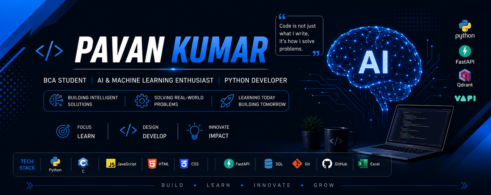

  

# Hi, I'm Pavan Kumar 👋

**BCA Student · Python Developer · AI & Machine Learning Enthusiast**

Welcome to my GitHub profile! I am a Bachelor of Computer Applications (BCA) student with a deep passion for Artificial Intelligence, Machine Learning, and software development. I love transforming ideas into working products that solve real-world problems, and I am constantly learning and experimenting with new technologies through personal projects, open-source contributions, and hackathons.

My core interests lie in backend development, intelligent systems, and building scalable applications that make a genuine impact. Whether it's designing an AI assistant, engineering a data-driven platform, or exploring the latest in machine learning, I enjoy every step of the process — from the first line of code to the final deployment.

---

## 🧑‍💻 About Me

- 🎓 Pursuing a Bachelor of Computer Applications (BCA)
- 🤖 Focused on Artificial Intelligence and Machine Learning
- 💻 Python developer with a strong interest in backend development using FastAPI and Flask
- 📊 Enthusiastic about Data Analytics, Automation, and building efficient systems
- 🏆 Active hackathon participant, including the Redrob AI – India Runs Data & AI Challenge
- 🌱 Currently deepening my knowledge of Machine Learning, REST APIs, Cloud Technologies, and Software Architecture
- 🤝 Open to Internships, Freelance Opportunities, and Open Source Contributions
- 💬 Always happy to collaborate on AI, Python, and backend projects

---

## 🛠️ Technical Skills

**Programming Languages**
- Python
- C
- JavaScript

**Web & Backend Development**
- HTML
- CSS
- FastAPI
- Flask

**Databases**
- SQL

**Tools & Platforms**
- Git & GitHub
- Visual Studio Code
- Microsoft Excel
- Google Sheets

**Areas of Interest**
- Artificial Intelligence & Machine Learning
- Backend Development & REST APIs
- Data Analytics & Automation
- Vector Databases & Natural Language Processing

---

## 🚀 Featured Projects

### 🔹 Sahaya AI
An AI-powered multilingual assistant built with Python, FastAPI, Qdrant Vector Database, Sentence Transformers, and Vapi. The system delivers intelligent, context-aware responses and improves access to information through natural language interactions. It combines semantic search with modern language models to understand user intent across multiple languages, making information more accessible and inclusive.

**Tech Stack:** Python · FastAPI · Qdrant · Sentence Transformers · Vapi

### 🔹 BMS College ERP System
A comprehensive Enterprise Resource Planning platform for institutional staff management, built with Python and Flask. It integrates attendance tracking, leave management, task allocation, payroll and payslip generation, expense claims, real-time chat, and video conferencing into a single, unified, role-based system. Designed for admins, HR, principals, HODs, and faculty, it streamlines day-to-day institutional operations through automated workflows and a clean, responsive interface.

**Tech Stack:** Python · Flask · SQLAlchemy · Flask-SocketIO · Jinja2 · SQLite

### 🔹 KSP AI – Crime Intelligence Platform
An AI-driven crime intelligence platform designed to assist law-enforcement workflows through data analysis and intelligent insights. The project explores how artificial intelligence and machine learning can support faster, more informed decision-making in public-safety and investigative contexts.

**Tech Stack:** Python · Machine Learning · AI · Data Analytics

### 🔹 Redrob Connect
An AI-powered recruitment intelligence platform built for the Redrob AI – India Runs Data & AI Challenge. It ranks 100,000 candidate profiles for a Senior AI Engineer role in under 11 seconds on CPU, using a 7-component weighted scoring system with skill-trust validation and honeypot detection. The ranker reads the actual job description to penalise consulting-firm backgrounds and keyword stuffers, producing a top-100 shortlist with unique, fact-grounded reasoning for each candidate. A full recruitment platform was built on top — featuring live weight tuning, skill heatmaps, map search, candidate comparison, and an AI chatbot — all running entirely in-browser with zero backend.

**Tech Stack:** Python · AI & Data Science · Weighted Scoring · In-Browser Processing

### 🔹 AI & Machine Learning Projects
A growing collection of AI/ML work from hackathons and personal learning, centered on backend development, intelligent systems, and practical problem solving. These projects reflect my hands-on approach to mastering machine learning concepts and applying them to meaningful use cases.

**Tech Stack:** Python · Machine Learning · REST APIs

---

## 🌱 Currently Learning

- Machine Learning
- Deep Learning
- FastAPI
- REST API Development
- Data Analytics
- Cloud Computing

---

## 🎯 Career Objective

I am passionate about developing intelligent software solutions that create real-world impact. My goal is to continuously improve my technical skills, contribute to meaningful open-source and team projects, and build a successful career at the intersection of Artificial Intelligence and Software Development. I strive to keep learning, stay curious, and grow into an engineer who builds products that genuinely help people.

---

## 📊 GitHub Statistics

  
  

  

---

## 🤝 Connect With Me

- **LinkedIn:** [pavan-kumar-02a704374](https://www.linkedin.com/in/pavan-kumar-02a704374/)
- **GitHub:** [pk7745](https://github.com/pk7745)
- **Email:** [pk9396247@gmail.com](mailto:pk9396247@gmail.com)

---

  <i>Thank you for visiting my profile! Feel free to explore my repositories, star the ones you find interesting, and connect with me. Let's build something impactful together.</i>

